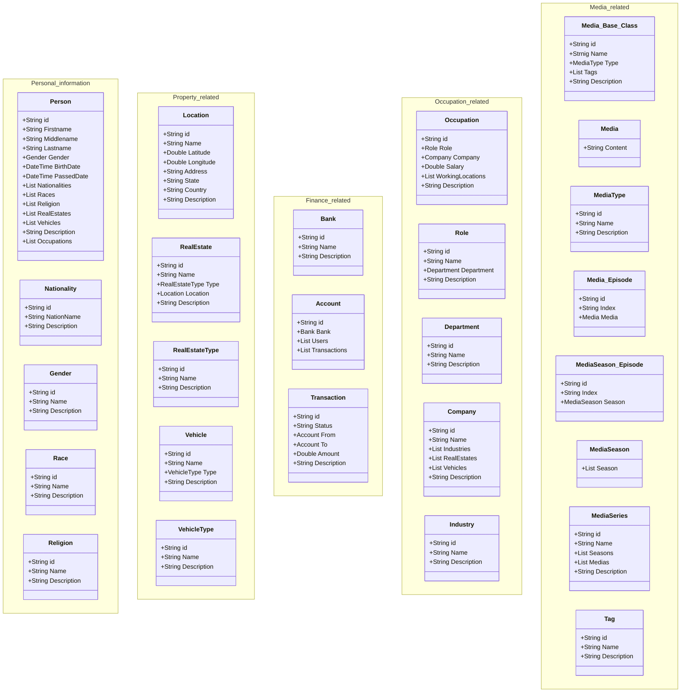

# Revising SQL

To practice and revise back SQL.

## Database Design

This will be the database used for practice later.

```mermaid
classDiagram

    namespace Personal_information {
        class Person {
            +String id
            +String Firstname
            +String Middlename
            +String Lastname
            +Gender Gender
            +DateTime BirthDate
            +DateTime PassedDate
            +List<Nationality> Nationalities
            +List<Race> Races
            +List<Religion> Religion
            +List<RealEstate> RealEstates
            +List<Vehicle> Vehicles
            +String Description
            +List<Occupation> Occupations
        }

        class Nationality {
            +String id
            +String NationName
            +String Description
        }

        class Gender {
            +String id
            +String Name
            +String Description
        }

        class Race {
            +String id
            +String Name
            +String Description
        }

        class Religion {
            +String id
            +String Name
            +String Description
        }
    }

    namespace Property_related {
        class Location {
            +String id
            +String Name
            +Double Latitude
            +Double Longitude
            +String Address
            +String State
            +String Country
            +String Description
        }

        class RealEstate {
            +String id
            +String Name
            +RealEstateType Type
            +Location Location
            +String Description
        }

        class RealEstateType {
            +String id
            +String Name
            +String Description
        }

        class Vehicle {
            +String id
            +String Name
            +VehicleType Type
            +String Description
        }

        class VehicleType {
            +String id
            +String Name
            +String Description
        }
    }

    namespace Finance_related {
        class Bank {
            +String id
            +String Name
            +String Description
        }

        class Account {
            +String id
            +Bank Bank
            +List<Person> Users
            +List<Transaction> Transactions
        }

        class Transaction {
            +String id
            +String Status
            +Account From
            +Account To
            +Double Amount
            +String Description
        }
    }

    namespace Occupation_related {
        class Occupation {
            +String id
            +Role Role
            +Company Company
            +Double Salary
            +List<Location> WorkingLocations
            +String Description
        }

        class Role {
            +String id
            +String Name
            +Department Department
            +String Description
        }

        class Department {
            +String id
            +String Name
            +String Description
        }

        class Company {
            +String id
            +String Name
            +List<Industry> Industries
            +List<RealEstate> RealEstates
            +List<Vehicle> Vehicles
            +String Description
        }

        class Industry {
            +String id
            +String Name
            +String Description
        }
    }

    namespace Media_related {
        class Media_Base_Class {
            +String id
            +Strnig Name
            +MediaType Type
            +List<Tag> Tags
            +String Description
        }

        class Media {
            +String Content
        }

        class MediaType {
            +String id
            +String Name
            +String Description
        }

        class Media_Episode {
            +String id
            +String Index
            +Media Media
        }

        class MediaSeason_Episode {
            +String id
            +String Index
            +MediaSeason Season
        }

        class MediaSeason {
            +List<Media_Episode> Season
        }

        class MediaSeries {
            +String id
            +String Name
            +List<MediaSeason_Episode> Seasons
            +List<Media_Episode> Medias
            +String Description
        }

        class Tag {
            +String id
            +String Name
            +String Description
        }
    }
```